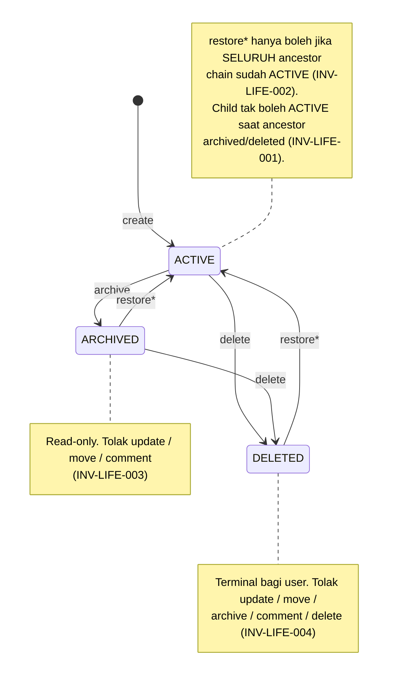

# 02 — SPEC (Functional Requirements · Business Rules · API Contract)

> Status: **Locked for MVP** — Normative. This is the primary contract for implementation.
> Terminology MUST/MUST NOT/SHOULD/MAY follows RFC 2119.
> Related: 01-PRODUCT.md, 03-ENGINEERING.md, 04-DELIVERY.md

---

# PART A — Business Rules & Domain Invariants

This is the most important part for implementation correctness. If code violates any invariant here, it is wrong **even if it "works"**.

## A.1 Hierarchy Invariants

- **BR-001** Setiap Milestone MUST memiliki tepat satu Project.
- **BR-002** Setiap Board MUST memiliki tepat satu Milestone.
- **BR-003** Setiap List MUST memiliki tepat satu Board.
- **BR-004** Setiap Card MUST memiliki tepat satu List.
- **BR-005** Card MUST NOT berdiri tanpa List.
- **BR-006** Entity MUST NOT berpindah antar-Project dalam kondisi apa pun.

## A.2 Project Isolation

- **BR-007** Project adalah **hard isolation boundary** untuk: data, hierarchy, membership, permission, permission group, API Key, Activity, Label, dan authorization context.
- **BR-008** Tidak ada API yang mengizinkan `move child from Project A to Project B`.
- **BR-009** Membership & permission di Project A MUST NOT otomatis berlaku di Project B, meski User sama menjadi anggota keduanya.
- **BR-010** Tidak ada requirement cross-project search di MVP.

## A.3 Entity Lifecycle

State kanonik:

```text
ACTIVE:    archived_at = NULL, deleted_at = NULL
ARCHIVED:  archived_at != NULL, deleted_at = NULL
DELETED:   deleted_at != NULL   (mengalahkan archived_at dalam determinasi state)
```

State machine (berlaku untuk Project, Milestone, Board, List, Card):



- **BR-011** `deleted_at` MUST diprioritaskan saat menentukan state entity.
- **BR-012** Implementasi SHOULD menyediakan helper eksplisit (`IsActive()`, `IsArchived()`, `IsDeleted()`) dan MUST NOT menyebarkan logika interpretasi lifecycle ke banyak tempat berbeda.

### INV-LIFE-001 — Ancestor Activity Requirement
Child MUST NOT berstatus ACTIVE apabila ada ancestor yang ARCHIVED atau DELETED. → `ACTIVE child ⟹ ACTIVE ancestor chain`.

### INV-LIFE-002 — Restore Dependency
Child MAY di-restore **hanya jika** seluruh ancestor chain-nya ACTIVE, berurutan dari ancestor teratas.
```text
Board=ARCHIVED, List=ARCHIVED → restore List langsung: DENY
Urutan benar: restore Board, lalu restore List
```

### INV-LIFE-003 — Archived Resource Mutation
Entity ARCHIVED MUST NOT menerima: update, move, comment (minimal).

### INV-LIFE-004 — Deleted Resource Mutation
Entity DELETED MUST NOT menerima: update, move, archive, comment, delete. Satu-satunya operasi valid tersisa adalah restore (tunduk INV-LIFE-002).

## A.4 Parent-Child Handling

- **BR-013** Parent entity (Project, Milestone, Board, List — Card bukan parent) yang di-**archive atau delete** MUST menawarkan pilihan child handling: `archive` / `delete` / `move`.
- **BR-014** Child handling adalah **pilihan opsional user**, bukan kewajiban selalu memindahkan child.
- **BR-015** Project MUST NOT menyediakan strategi `move` untuk child handling (tidak ada Project tujuan valid — cross-project transfer dilarang).
- **BR-016** Card MUST NOT memiliki child handling apa pun (leaf entity).

## A.5 Move Invariants

- **INV-MOVE-001 — Same Project.** Entity yang dipindahkan (List, Board, Card) MUST tetap dalam Project sama.
- **INV-MOVE-002 — Valid Destination.** Destination MUST: ada, berada di Project sama, berstatus ACTIVE, dan menjadi parent valid secara hierarki untuk entity yang dipindahkan.
- **INV-MOVE-003 — Destination Authorization.** Actor MUST punya permission cukup untuk menulis ke destination. **Permission menghapus source TIDAK otomatis memberi permission menulis destination.**
- **INV-MOVE-004 — Atomicity.** Delete/archive parent dengan child movement MUST atomic: source transition + child movement + activities semua berhasil, atau semua rollback.

## A.6 Card Movement (Spesifik)

- **BR-017** Card MUST berpindah List via domain operation khusus (`/cards/:id/move`), MUST NOT via `PATCH card.list_id`.
- **BR-018** Card MAY berpindah Board hanya jika `source_board.milestone_id == target_board.milestone_id`. Ini **business invariant**, bukan sekadar permission check — berlaku walau User punya permission penuh di kedua Board.

## A.7 Concurrency (Optimistic Locking)

- **BR-019** Setiap entity mutable MUST memiliki `version`.
- **BR-020** Concurrency MUST dievaluasi **per-entity**, bukan per-Project/global — mutation Card A tidak boleh menyebabkan konflik pada Card B.
- **BR-021** Mutation membawa `expected_version`; jika `current_version != expected_version` → `409 VERSION_CONFLICT`, tanpa perubahan state, tanpa Activity domain untuk request yang ditolak.
- **BR-022** Prinsip: **"Last valid write wins"**, bukan "last write wins".
- **BR-023** MVP pakai **entity-level locking**, bukan field-level — dua mutation pada field berbeda di entity sama tetap saling konflik jika version sama.

## A.8 Activity (Audit Trail)

- **BR-024** Activity MUST immutable & append-only — tidak ada UPDATE/DELETE.
- **BR-025** Setiap entity (Project, Milestone, Board, List, Card) MUST memiliki Activity sendiri.
- **BR-026** Activity MUST mencatat action spesifik (mis. `card.moved`, bukan generic `entity.status_changed`).
- **BR-027** Operasi lifecycle pada parent (dengan child handling) MUST menghasilkan Activity terpisah untuk setiap descendant terdampak.
- **BR-028** Activity payload MUST menyimpan cukup konteks historis agar tetap bermakna walau entity yang direferensikan (mis. nama List lama) sudah dihapus.
- **BR-029** `actor_user_id` pada Activity MUST tetap valid historis walau membership actor dicabut — MUST NOT jadi NULL.

## A.9 Comment

- **BR-030** Comment adalah bagian dari Activity Card.
- **BR-031** Comment MAY dibuat & diedit, MUST NOT dihapus.
- **BR-032** Edit comment MUST menghasilkan Activity baru (`comment.edited`) tanpa mengubah Activity `comment.added` lama.
- **BR-033** Comment baru MUST ditolak pada Card berstatus DELETED atau ARCHIVED.
- **BR-034** Race condition (Card dihapus tepat saat User lain menambah comment) MUST dicegah dengan validasi state Card **saat request diproses**, bukan berdasarkan state saat UI dibuka.

## A.10 Permission & Authorization

### Formula Otorisasi Resmi
```text
ALLOW(operation) =
    valid membership
    AND permission granted
    AND scope matches
    AND entity state permits operation
    AND business invariant permits operation
    AND optimistic-lock version valid
```
Semua kondisi harus TRUE. Tidak ada komponen yang boleh dilewati hanya karena komponen lain terpenuhi.

- **BR-035** Owner adalah **ownership property** (`Project.owner_user_id`), bukan Permission Group. Owner MUST NOT kehilangan ownership akibat perubahan Permission Group apa pun.
- **BR-036** Co-Owner MUST diimplementasikan sebagai Permission Group biasa, bukan ownership kedua. Co-Owner MUST NOT otomatis bypass permission check.
- **BR-037** Owner MAY bypass permission-group restriction untuk operasi dalam Project miliknya, tetapi tetap tunduk business invariant (mis. tidak bisa cross-project move) & concurrency validation.
- **BR-038** Permission bersifat **additive** — MVP MUST NOT mengimplementasikan DENY. Effective permission = union seluruh grant berlaku dari semua Permission Group User.
- **BR-039** Permission Group MUST Project-scoped, bukan global, dan MUST bukan hard-coded role (`if role == "manager"` dilarang).
- **BR-040** Perubahan Permission Group (tambah/kurangi permission) MUST langsung berlaku ke semua member yang memakainya — tidak ada snapshot permission per membership.
- **BR-041** Soft-delete Permission Group MUST menyebabkan seluruh member kehilangan permission dari group tersebut, tanpa menghapus riwayat assignment.
- **BR-042** Permission MAY diberikan pada level Project/Milestone/Board/List/Card & diwariskan ke descendant.
- **BR-043** Otorisasi MUST dievaluasi **per-operasi** — `card.read` MUST NOT diasumsikan memberi `card.update`, `card.move`, `card.delete`, dsb.
- **BR-044** `card.move` adalah permission tersendiri, terpisah dari `card.update` — karena Move adalah state transition yang lebih consequential.
- **BR-045** Creator & Assignee pada Card **bukan permission grant**. Menjadi creator/assignee TIDAK otomatis memberi hak update/delete — hak tetap dari Permission Group.
- **BR-046** Lifecycle entity selalu menang atas permission: walau User punya `card.delete`, jika Card DELETED, seluruh operasi mutasi tetap DENY.

## A.11 Card Visibility Scope

- **BR-047** Card memiliki dimensi visibility tambahan: `ALL`, `CREATED_BY_ME`, `ASSIGNED_TO_ME`.
  - `ALL` — semua Card dalam applicable authorization scope.
  - `CREATED_BY_ME` — Card dengan `creator_user_id == current_user_id`.
  - `ASSIGNED_TO_ME` — Card dengan `assignee_user_id == current_user_id`.
- **BR-048** Urutan keluasan: `ASSIGNED_TO_ME < CREATED_BY_ME < ALL`. Jika User punya beberapa grant scope berbeda, **scope terluas menang** (union, bukan intersection).
- **BR-049** Scope visibility MUST NOT berubah hanya karena User berada di child hierarchy berbeda — scope konsisten sesuai grant.

## A.12 Invitation & Membership

- **BR-050** Membership Project MUST melalui invitation — tidak ada join bebas.
- **BR-051** Invitation MUST menentukan Permission Group sejak dibuat.
- **BR-052** Invitation SHOULD menyimpan **reference** ke Permission Group, bukan snapshot seluruh definisi permission — jika Group berubah sebelum/sesudah acceptance, User dapat definisi Group yang berlaku saat itu.
- **BR-053** Pencabutan membership MUST mencabut otorisasi berjalan, MUST NOT menghapus data historis (`creator_user_id`, `activity.actor_user_id` tetap utuh).
- **BR-054** Jika Assignee kehilangan membership, sistem MUST men-set `assignee_user_id = NULL` & mencatat Activity `card.unassigned`. `creator_user_id` MUST NOT berubah.

## A.13 Credential (API Key & PAT)

- **BR-055** API Key adalah credential **Project-scoped** — bukan model otorisasi baru. Alur tetap: `API Key → User → Project Membership → Permission`.
- **BR-056** PAT adalah credential **User-scoped**, dapat dipakai lintas Project sesuai membership User, MUST tidak memberi permission tambahan di luar yang dimiliki User.
- **BR-057** Credential secret MUST disimpan sebagai hash, tidak pernah plaintext; raw secret hanya ditampilkan sekali saat pembuatan.
- **BR-058** Credential expired atau revoked MUST ditolak saat autentikasi.

## A.14 Database Cascade

- **BR-059** Business deletion MUST NOT bergantung pada `ON DELETE CASCADE` sebagai pengganti domain logic. Child handling, otorisasi, lifecycle, Activity, transaksi, & semantik restore MUST dikendalikan eksplisit oleh application/domain layer.
- **BR-060** Database cascade MAY dipakai hanya jika tidak melanggar semantik domain di atas.

## A.15 API Design Constraint

- **BR-061** Business transition (move/archive/restore/delete) MUST NOT diimplementasikan sebagai arbitrary field update via generic PATCH.
- **BR-062** Generic PATCH MUST NOT mengizinkan perubahan field yang dikendalikan domain: `id`, `project_id`, `creator_user_id`, `created_at`, `version`, `archived_at`, `deleted_at`, serta relasi hierarki (mis. `list_id`).

## A.16 Sepuluh Invariant Inti (Jantung Aplikasi)

1. Every Card MUST belong to exactly one List.
2. Every List MUST belong to exactly one Board.
3. Every Board MUST belong to exactly one Milestone.
4. Resources MUST NOT cross Project boundaries.
5. A Card MAY move between Boards only inside the same Milestone.
6. Mutations MUST validate current state before committing.
7. Concurrent mutations MUST use optimistic concurrency/version checking.
8. Activity MUST be immutable and append-only.
9. Entity mutation and its Activity MUST commit atomically.
10. Authorization MUST be evaluated against the entity's current hierarchy, per operation.

---

# PART B — Functional Requirements

Requirement fungsional per modul. Setiap FR dapat ditelusuri ke BR/INV terkait di Part A.

## B.1 Project
- **FR-001** Sistem MUST mengizinkan User membuat Project baru; pembuat otomatis jadi Owner.
- **FR-002** Sistem MUST memastikan setiap Project punya tepat satu Owner.
- **FR-003** Sistem MUST NOT menyediakan operasi pemindahan resource antar-Project.
- **FR-004** Sistem MUST mendukung lifecycle Project (Active/Archived/Deleted) dengan child handling (archive/delete descendants) tanpa opsi "move".

## B.2 Membership & Invitation
- **FR-005** Sistem MUST mensyaratkan invitation untuk join Project (tidak ada join bebas).
- **FR-006** Invitation MUST menentukan Permission Group(s) sejak dibuat.
- **FR-007** Setelah invitation diterima, sistem MUST otomatis membuat Membership dengan Permission Group sesuai invitation.
- **FR-008** Sistem MUST mengizinkan revoke membership; efeknya pencabutan otorisasi, bukan penghapusan data historis.

## B.3 Permission Group
- **FR-009** Permission Group MUST Project-scoped (bukan global).
- **FR-010** Sistem MUST mendukung baseline groups (Co-Owner, Manager, Contributor, Viewer) yang permission-nya dapat dikonfigurasi, bukan hard-coded.
- **FR-011** Sistem MUST menghitung effective permission sebagai union seluruh grant berlaku (additive, tanpa DENY).
- **FR-012** Perubahan permission pada Group MUST langsung berlaku ke seluruh member (live reference, bukan snapshot).
- **FR-013** Sistem MUST mendukung permission assignment pada level Project/Milestone/Board/List/Card, dengan pewarisan ke descendant.

## B.4 Milestone
- **FR-014** Sistem MUST mengizinkan pembuatan Milestone (title, description, progress 0–100, start_date, due_date).
- **FR-015** Sistem MUST NOT menghitung progress Milestone otomatis dari Card/List.
- **FR-016** Sistem MUST NOT menyediakan field status pada Milestone di MVP.
- **FR-017** Milestone MUST mendukung Milestone Label yang dapat dipakai semua Board di dalamnya.

## B.5 Board
- **FR-018** Sistem MUST mengizinkan pembuatan Board di bawah Milestone.
- **FR-019** Board MUST NOT punya status, warna, ikon, atau WIP limit di MVP.
- **FR-020** Board MUST mendukung Board Label yang hanya berlaku pada Board tersebut.

## B.6 List
- **FR-021** Sistem MUST mengizinkan pembuatan List (title bebas tanpa semantic bawaan).
- **FR-022** Sistem MUST menolak penghapusan List selama masih punya Card aktif.
- **FR-023** List MUST NOT punya field status di MVP.

## B.7 Card
- **FR-024** Sistem MUST mengizinkan pembuatan Card (title, subtitle, description, due_date).
- **FR-025** Sistem MUST mencatat creator sebagai historical reference yang tidak berubah walau membership dicabut.
- **FR-026** Sistem MUST mendukung maks satu assignee; assignee MUST jadi NULL otomatis jika membership assignee dicabut.
- **FR-027** Sistem MUST mengizinkan Card pindah List via domain operation khusus (move), bukan update field biasa.
- **FR-028** Sistem MUST mengizinkan Card pindah Board hanya jika Board sumber & tujuan dalam Milestone sama.
- **FR-029** Sistem MUST NOT mengizinkan Card pindah lintas Project.
- **FR-030** Sistem MUST menolak move Card jika `expected_version` tidak sesuai versi terkini.

## B.8 Label
- **FR-031** Sistem MUST mendukung dua scope Label: Milestone Label & Board Label.
- **FR-032** Card MUST dapat punya banyak Label dari kedua scope tanpa batas di MVP.
- **FR-033** Sistem MUST mempertahankan riwayat asosiasi Label-Card (created_at/removed_at) alih-alih hapus baris fisik saat orphaned.
- **FR-034** Sistem MUST NOT mengizinkan Label orphaned dipakai sebagai Label aktif baru.

## B.9 Activity
- **FR-035** Sistem MUST mencatat Activity untuk setiap perubahan signifikan pada Project, Milestone, Board, List, Card.
- **FR-036** Activity MUST append-only & immutable — tidak ada endpoint UPDATE/DELETE.
- **FR-037** Activity MUST menyimpan cukup konteks historis (mis. nama List sebelumnya) agar tetap bermakna walau entity terkait dihapus.
- **FR-038** Operasi lifecycle pada parent (dengan child handling) MUST menghasilkan Activity untuk setiap descendant terdampak.

## B.10 Comment
- **FR-039** Sistem MUST mengizinkan penambahan comment pada Card sebagai bagian Activity Card.
- **FR-040** Sistem MUST mengizinkan edit comment, dengan Activity baru (`comment.edited`) tanpa mengubah Activity lama.
- **FR-041** Sistem MUST NOT menyediakan penghapusan comment.
- **FR-042** Sistem MUST menolak comment baru pada Card berstatus Deleted atau Archived.

## B.11 Lifecycle
- **FR-043** Sistem MUST mendukung state Active/Archived/Deleted untuk Project, Milestone, Board, List, Card.
- **FR-044** Sistem MUST NOT mengizinkan entity ACTIVE apabila ada ancestor Archived/Deleted.
- **FR-045** Sistem MUST menolak restore entity apabila ancestor belum sepenuhnya Active.
- **FR-046** Sistem MUST menyediakan opsi child handling (archive/delete/move) saat parent di-archive/delete, kecuali Card (leaf) & Project (tanpa move).
- **FR-047** Operasi child handling yang melibatkan banyak entity MUST transactional (all-or-nothing).

## B.12 Concurrency
- **FR-048** Setiap entity mutable MUST punya `version` yang increment atomically pada tiap mutation.
- **FR-049** Mutation SHOULD menyertakan `expected_version`; sistem MUST menolak dengan `VERSION_CONFLICT` jika tidak sesuai.
- **FR-050** Concurrency check MUST per-entity (bukan per-Project/global).

## B.13 Credential
- **FR-051** Sistem MUST mendukung API Key per Project, dengan expiration & revocation.
- **FR-052** Sistem MUST mendukung PAT pada level User, dapat dipakai lintas Project sesuai membership.
- **FR-053** Sistem MUST menyimpan credential secret sebagai hash, tidak pernah plaintext.
- **FR-054** Sistem MUST menolak autentikasi dengan credential revoked/expired.

## B.14 API & Sinkronisasi
- **FR-055** API MUST membedakan CRUD biasa dari domain command (move/archive/restore/delete) untuk operasi dengan business meaning.
- **FR-056** Generic update (PATCH) MUST NOT mengizinkan perubahan field yang dikendalikan domain.
- **FR-057** MVP MUST beroperasi tanpa realtime; client pakai pull/refresh.

---

# PART C — API Contract

## C.1 Prinsip Dasar

API MUST membedakan:
```text
CRUD-like              Domain commands
├── create              ├── move
├── update (terbatas)   ├── archive
└── read                ├── restore
                         └── delete
```
Operasi dengan **business meaning** MUST diekspresikan sebagai domain command eksplisit, bukan generic field update. Base path kanonik: `/api/v1`. Semua resource Project di bawah `project_id`. **Tidak ada** endpoint cross-project.

```text
POST /resource/:id/delete      ✓ direkomendasikan
DELETE /resource/:id           ✗ dihindari untuk entity dengan lifecycle kompleks
```

## C.2 Response Convention

Success: `{ "data": {} }`

Error:
```json
{ "error": { "code": "VERSION_CONFLICT", "message": "The card has been modified by another request." } }
```

Error codes kanonik minimum:
```text
PROJECT_ACCESS_DENIED · PERMISSION_DENIED · RESOURCE_NOT_FOUND · RESOURCE_ARCHIVED
RESOURCE_DELETED · INVALID_STATE · INVALID_DESTINATION · INVALID_CHILD_HANDLING
VERSION_CONFLICT · TOKEN_EXPIRED · TOKEN_REVOKED · INVITATION_EXPIRED · INVITATION_ALREADY_USED
```

## C.3 Idempotency

Untuk mutation yang berpotensi diulang akibat network retry, gunakan `Idempotency-Key: <client-generated-key>`, terutama untuk `POST` yang membuat resource atau menjalankan domain command berisiko (create, move, delete dengan child handling).

## C.4 Project
```http
GET    /api/v1/projects/:project_id
PATCH  /api/v1/projects/:project_id
POST   /api/v1/projects/:project_id/archive
POST   /api/v1/projects/:project_id/restore
POST   /api/v1/projects/:project_id/delete
```
Delete body (tanpa `move`, lihat BR-015):
```json
{ "child_handling": { "strategy": "archive" }, "expected_version": 4 }
```

## C.5 Milestone
```http
POST   /api/v1/projects/:project_id/milestones
GET    /api/v1/projects/:project_id/milestones/:milestone_id
PATCH  /api/v1/projects/:project_id/milestones/:milestone_id
POST   /api/v1/projects/:project_id/milestones/:milestone_id/archive
POST   /api/v1/projects/:project_id/milestones/:milestone_id/restore
POST   /api/v1/projects/:project_id/milestones/:milestone_id/delete
```
Create:
```json
{ "title": "MVP", "description": "...", "progress": 0, "start_date": "2026-08-17", "due_date": "2026-09-30" }
```
Update (`PATCH`) wajib membawa `expected_version`. Delete/Archive dengan child handling:
```json
{ "child_handling": { "strategy": "move", "destination_id": "milestone_456" }, "expected_version": 4 }
```
`destination_id` hanya muncul jika `strategy = "move"`.

## C.6 Board
```http
POST   /api/v1/projects/:project_id/milestones/:milestone_id/boards
GET    /api/v1/projects/:project_id/boards/:board_id
PATCH  /api/v1/projects/:project_id/boards/:board_id
POST   /api/v1/projects/:project_id/boards/:board_id/archive
POST   /api/v1/projects/:project_id/boards/:board_id/restore
POST   /api/v1/projects/:project_id/boards/:board_id/delete
```
Child handling Board mencakup List (dan Card di dalamnya transitif). Destination untuk `move` harus Board dalam **Milestone sama**.

## C.7 List
```http
POST   /api/v1/projects/:project_id/boards/:board_id/lists
GET    /api/v1/projects/:project_id/lists/:list_id
PATCH  /api/v1/projects/:project_id/lists/:list_id
POST   /api/v1/projects/:project_id/lists/:list_id/move
POST   /api/v1/projects/:project_id/lists/:list_id/archive
POST   /api/v1/projects/:project_id/lists/:list_id/restore
POST   /api/v1/projects/:project_id/lists/:list_id/delete
```
Move: `{ "destination_board_id": "board_456", "expected_version": 7 }`
Delete List dengan Card membutuhkan child handling (`archive cards` / `delete cards` / `move cards`).

## C.8 Card
```http
POST   /api/v1/projects/:project_id/lists/:list_id/cards
GET    /api/v1/projects/:project_id/cards/:card_id
PATCH  /api/v1/projects/:project_id/cards/:card_id
POST   /api/v1/projects/:project_id/cards/:card_id/move
POST   /api/v1/projects/:project_id/cards/:card_id/archive
POST   /api/v1/projects/:project_id/cards/:card_id/restore
POST   /api/v1/projects/:project_id/cards/:card_id/delete
```
`PATCH` boleh mengubah: `title`, `subtitle`, `description`, `due_date`, `assignee`. **Tidak boleh** mengubah `list_id`.

Move: `{ "destination_list_id": "list_456", "expected_version": 12 }`

Server MUST memvalidasi: source Card, source List, destination List, kesamaan Project, destination ACTIVE, otorisasi, version, dan business invariant (`source_board.milestone_id == target_board.milestone_id`) sebelum eksekusi.

Card **tidak memiliki** `child_handling` pada archive/delete/restore (BR-016).

## C.9 Activity
```http
GET /api/v1/projects/:project_id/activities?entity_type=card&entity_id=c1&actor=&action=&from=&to=
GET /api/v1/projects/:project_id/cards/:card_id/activities
GET /api/v1/projects/:project_id/milestones/:milestone_id/activities
GET /api/v1/projects/:project_id/boards/:board_id/activities
GET /api/v1/projects/:project_id/lists/:list_id/activities
```
Activity tidak memiliki `PUT`/`PATCH`/`DELETE` dalam bentuk apa pun.

## C.10 Comment
```http
POST   /api/v1/projects/:project_id/cards/:card_id/comments
PATCH  /api/v1/projects/:project_id/cards/:card_id/comments/:activity_id
```
Add: `{ "body": "Sudah saya cek." }` → Activity `comment_added`. Edit **tidak mengubah** Activity lama — menghasilkan Activity baru `comment_edited`. Tidak ada `DELETE`.

## C.11 Label
```http
POST /api/v1/projects/:project_id/milestones/:milestone_id/labels     # Milestone Label
POST /api/v1/projects/:project_id/boards/:board_id/labels             # Board Label
POST /api/v1/projects/:project_id/cards/:card_id/labels               # Assign ke Card
```
Assign: `{ "label_id": "label_123" }`. Server menentukan scope Label & memvalidasi keabsahannya terhadap posisi Card saat ini.

## C.12 Permission & Membership
```http
GET    /api/v1/projects/:project_id/permission-groups
POST   /api/v1/projects/:project_id/permission-groups
PATCH  /api/v1/projects/:project_id/permission-groups/:group_id
POST   /api/v1/projects/:project_id/members/:membership_id/groups
```
Assignment: `{ "group_id": "group_123" }`

## C.13 Invitation
```http
POST /api/v1/projects/:project_id/invitations
POST /api/v1/invitations/:invitation_id/accept
```
Create: `{ "email": "user@example.com", "group_ids": ["developer", "reviewer"] }`
Setelah accept: `Invitation → Membership → Permission Groups` otomatis, tanpa assignment kedua kali.

## C.14 API Key & PAT
```http
POST /api/v1/projects/:project_id/api-keys
POST /api/v1/projects/:project_id/api-keys/:key_id/revoke
POST /api/v1/me/personal-access-tokens
POST /api/v1/me/personal-access-tokens/:token_id/revoke
```
Response secret hanya diberikan sekali saat creation. Tidak ada update secret — hanya revoke + create baru.

## C.15 Generic PATCH — Batasan Wajib

Generic `PATCH` MUST NOT menerima field yang merepresentasikan business transition atau field yang dikendalikan domain: `id`, `project_id`, `creator_user_id`, `created_at`, `version`, `archived_at`, `deleted_at`, `list_id` (atau relasi hierarki lain). Field ini hanya berubah lewat domain command yang menjalankan validasi permission, state, & business invariant.

## C.16 Rekap Prinsip API

> Tidak boleh ada API endpoint yang memungkinkan client secara langsung mengubah field yang merepresentasikan business transition.

Ini aturan paling penting dari kontrak API dan acuan utama saat AI coding agent membuat route handler baru.

---

# PART D — Permission Reference (Authorization Matrix)

## D.1 Permission Naming
Format kanonik: `<resource>.<action>`.
```text
project.read · project.update
milestone.read · milestone.create · milestone.update · milestone.archive · milestone.delete · milestone.restore
board.read · board.create · board.update · board.archive · board.delete · board.restore
list.read · list.create · list.update · list.move · list.archive · list.delete · list.restore
card.read · card.create · card.update · card.move · card.archive · card.delete · card.restore · card.comment · card.comment.update
member.read · member.invite · member.update · member.remove
permission_group.read · permission_group.create · permission_group.update · permission_group.delete
api_key.read · api_key.create · api_key.revoke
```

## D.2 Baseline Group Matrix (Konfigurable, Bukan Hard-coded)

Project-level:
| Operation | Owner | Co-Owner | Manager | Contributor | Viewer |
|---|:-:|:-:|:-:|:-:|:-:|
| View Project | ✓ | ✓ | ✓ | ✓ | ✓ |
| Update Project | ✓ | ✓ | — | — | — |
| Manage Members | ✓ | ✓ | — | — | — |
| Manage Permission Groups | ✓ | ✓ | — | — | — |
| Manage API Keys | ✓ | ✓ | — | — | — |

Milestone / Board / List (pola sama):
| Operation | Owner | Co-Owner | Manager | Contributor | Viewer |
|---|:-:|:-:|:-:|:-:|:-:|
| Read | ✓ | ✓ | ✓ | ✓ | ✓ |
| Create/Update/Archive/Delete/Restore | ✓ | ✓ | ✓ | — | — |
| Move (List saja) | ✓ | ✓ | ✓ | — | — |

Card:
| Operation | Owner | Co-Owner | Manager | Contributor | Viewer |
|---|:-:|:-:|:-:|:-:|:-:|
| Read | ✓ | ✓ | ✓ | ✓ | ✓ |
| Create/Update/Move/Archive/Delete/Comment | ✓ | ✓ | ✓ | ✓ | — |

Catatan: matrix ini adalah konfigurasi **default** baseline group. Nilai sebenarnya disimpan sebagai data (Permission Group → Permissions), bukan hard-coded `if role == ...`.

## D.3 Card Read Scope (dua dimensi terpisah)

Model otorisasi Card memisahkan dua hal:
```text
WHERE permission applies   (assignment level: Project/Milestone/Board/List/Card)
        +
WHICH cards are visible    (scope: ALL / CREATED_BY_ME / ASSIGNED_TO_ME)
```
Keduanya disimpan & dievaluasi terpisah. Contoh: `Manager Group assigned at Board` menentukan *di mana* permission berlaku; `card.read.scope = assigned_to_me` menentukan *Card mana* yang terlihat.

## D.4 Aturan Resolusi (ringkas)
```text
resolve_permission(user, project, entity, action):
  1. Verify membership
  2. Load applicable permission groups
  3. Resolve hierarchy (Project → Milestone → Board → List → Card)
  4. Collect permissions (union, additive)
  5. Resolve card scope if applicable (MAX broadest scope)
  6. Apply entity lifecycle restrictions (lifecycle wins)
  7. Return allow/deny
```
Owner: bypass permission-group (dalam Project sendiri), tetap tunduk business invariant + concurrency. Co-Owner: tidak bypass. Comment: `can_comment = can_read_card AND has(card.comment) AND card.is_active`.
