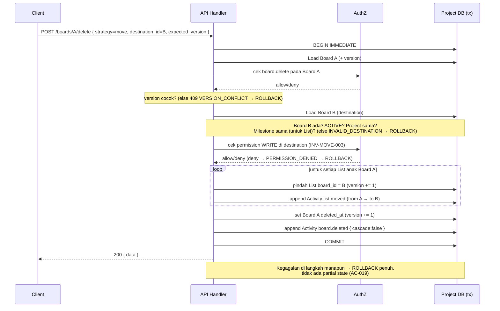
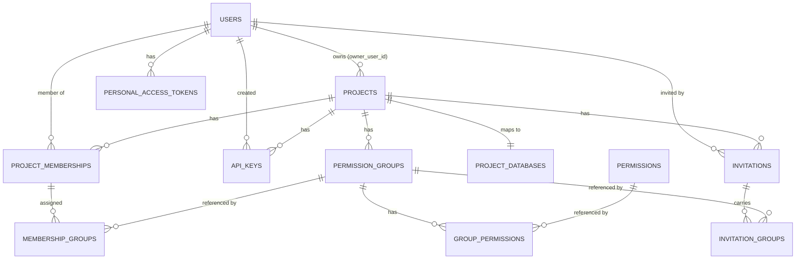
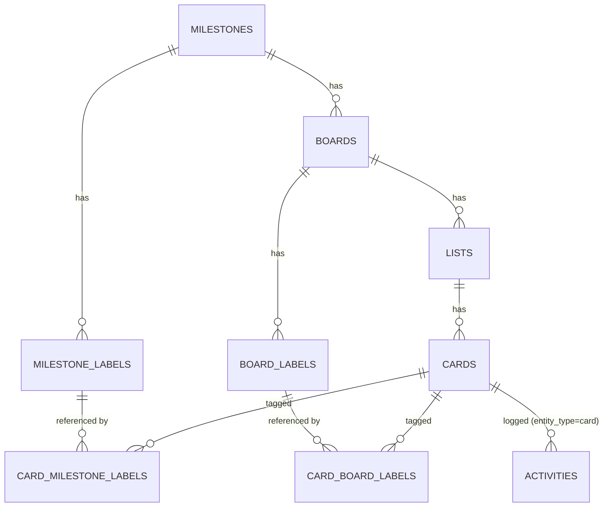

# 03 — ENGINEERING (Architecture · Database · Security · Deployment)

> Status: Structure locked; specific providers open (§ D)
> Related: 02-SPEC.md (normative rules), 04-DELIVERY.md

---

# PART A — Architecture

## A.1 Gaya Arsitektur

> **Modular monolith + API-first + database-per-project.**

Microservices **sengaja tidak dipilih** untuk MVP. Domain (Project, Membership, Permission, Milestone, Board, List, Card, Label, Activity, Credential) saling berhubungan erat & butuh **transactional consistency** kuat (mutation Card + Activity harus atomic). Memecahnya jadi service terpisah memperkenalkan network hop, transaction coordination, & event choreography yang tidak dibutuhkan pada skala MVP.

```text
Satu API application, satu codebase, satu deployment.
```

## A.2 Diagram Tingkat Tinggi

```text
                         ┌──────────────────┐
                         │      Client      │
                         │ Web / Mobile /   │
                         │ CLI / 3rd party  │
                         └────────┬─────────┘
                                  │ HTTPS / API
                         ┌────────▼─────────┐
                         │   API Layer      │
                         │ (Next.js Route   │
                         │   Handlers)      │
                         └────────┬─────────┘
                    ┌─────────────┴─────────────┐
             Identity/Auth              Project Resolver
                    └─────────────┬─────────────┘
                         ┌────────▼─────────┐
                         │ Project Database │
                         │    Resolver      │
                         └────────┬─────────┘
              ┌───────────────────┼───────────────────┐
              ▼                   ▼                   ▼
          Project A            Project B            Project C
          Database             Database             Database
```

## A.3 Dua Layer Database

```text
Global (Control Plane) DB
        │ resolve project_id → database
        ▼
Project Database
        ▼
Domain resources
```

**Global DB** (info lintas-Project): `users, projects, project_memberships, permission_groups, permissions, group_permissions, membership_groups, invitations, invitation_groups, api_keys, personal_access_tokens, project_databases`.

**Project DB** (domain Project-local): `milestones, milestone_labels, boards, board_labels, lists, cards, card_milestone_labels, card_board_labels, activities`.

Alasan: "User A punya akses ke Project B" adalah info **global**; "Card X di List Y" adalah info **Project-local**. Pemisahan membuat Project isolation eksplisit di level arsitektur, bukan hanya konvensi query.

## A.4 Database-per-Project = Isolation Strategy, Bukan Kontrak Publik

Domain model MUST NOT bergantung pada asumsi "satu Project = satu file SQLite fisik selamanya". `Project → logical database`, di-resolve via `project_databases` mapping table di Global DB. MVP: `Project A → database A`. Masa depan: sharding (`Project A, B → shard X`) tetap mungkin tanpa mengubah domain model.

Request flow wajib:
```text
Authentication → Identify User → Load Project → Verify Membership
→ Resolve Permission → Resolve Project Database → Execute Query
```

## A.5 Cross-Database Referential Integrity

`cards.creator_user_id` & `cards.assignee_user_id` menunjuk ke `users.id` di Global DB (database fisik berbeda). SQLite tidak menyediakan FK lintas database secara praktis. **Keputusan:** referential integrity terhadap User dilakukan di **application/domain layer**. Saat set `creator_user_id`/`assignee_user_id`, app layer MUST verifikasi User ada &, untuk assignee, punya membership aktif pada Project tersebut.

## A.6 Transaction Boundary

Mutation & Activity terkait MUST atomic:
```text
BEGIN TRANSACTION
    1. Load current entity
    2. Validate expected_version
    3. Validate permission
    4. Validate destination/business invariant
    5. Update entity (version += 1)
    6. Append Activity
COMMIT   (kegagalan step manapun → ROLLBACK)
```
Untuk SQLite, mutation + activity append SHOULD pakai `BEGIN IMMEDIATE` untuk hindari write-write race di level DB, di atas optimistic locking level aplikasi. Referensi rule: 02-SPEC A.7, A.8, INV-MOVE-004.

### A.6.1 Sequence — Child Handling (kasus paling rawan bug)

Contoh: **Delete Board A dengan `child_handling.strategy = move`** (List dipindah ke Board B). Ini alur paling kompleks; strategi `archive`/`delete` mengikuti pola yang sama tetapi tanpa langkah validasi/permission destination. Semua di dalam SATU transaksi (INV-MOVE-004) — kegagalan langkah manapun → rollback total.



Untuk `strategy = delete`/`archive`, langkah "pindah List" diganti transisi lifecycle tiap descendant + Activity `list.deleted`/`list.archived` dengan `{ cascade:true, via_parent:{board,A} }` (B.5), dan Card di dalamnya juga bertransisi + ber-Activity (BR-027). Subtree besar → pertimbangkan async job (A.10), tetapi tetap satu unit transaksional-logis.


## A.7 Struktur Kode (Domain-Oriented Modular Monolith)

```text
src/
├── app/api/                 # HTTP route handlers (thin layer)
├── modules/
│   ├── project/  membership/  permission/  milestone/
│   ├── board/  list/  card/  label/  activity/  credential/
├── infrastructure/
│   ├── database/            # DB resolver, migrations, query layer
│   ├── auth/                # session, API key, PAT resolution
│   └── storage/
└── shared/
    ├── errors/  validation/  types/
```

Domain-oriented (bukan `controllers/services/repositories/models` tercampur). Setiap module punya domain logic, validation, & data access sendiri — mudah dipetakan ke Business Rules per modul.

## A.8 Stack Teknologi

| Layer | Pilihan | Status |
|---|---|---|
| Frontend | Next.js + TypeScript | Direkomendasikan |
| API | Next.js Route Handlers | Direkomendasikan; dedicated service jika kelak dibutuhkan |
| Database engine | libSQL (SQLite-compatible) | **Locked (v1.0.1)** |
| Database provider | **Turso** (managed libSQL, database-per-project) | **Locked pending POC gate** — lihat A.11 |
| ORM / Query layer | **Drizzle ORM** (+ drizzle-kit untuk migration) | **Locked (v1.0.1)** — lihat A.12 |
| ID format | **ULID**, disimpan sebagai TEXT | **Locked (v1.0.1)** — lihat A.13 |
| Auth (web session) | **Auth.js (NextAuth)**, user di Global DB | **Locked (v1.0.3)** — lihat A.14 |
| Validation | Zod | Direkomendasikan |
| Deployment | Vercel | Direkomendasikan (Part D) |

> Ketiga keputusan yang sebelumnya *open* (provider database, ORM, format ID) kini dikunci di v1.0.1. Rationale & alternatif di A.11–A.13. Keputusan ini bersifat implementasi (tidak mengubah business invariant/authorization/lifecycle/API semantics), sehingga naik versi patch, bukan minor/major.

## A.11 Keputusan: Database Provider — Turso (libSQL)

**Keputusan:** Turso sebagai managed provider, engine libSQL (fork SQLite). **Locked pending POC gate** — artinya Turso adalah default yang dikerjakan, tetapi WAJIB melewati satu POC singkat di awal Phase 0 sebelum dikunci permanen.

**Alasan:**
- Turso/libSQL dirancang tepat untuk pola **database-per-tenant** — pembuatan banyak database logis per Project adalah use-case inti mereka, bukan workaround.
- Akses via HTTP/edge cocok untuk lingkungan **serverless** Vercel (tidak bergantung long-lived connection pool tradisional yang bermasalah di serverless).
- Kompatibel penuh dengan SQLite semantics yang jadi dasar seluruh desain schema (§ Part B).
- Mendukung provisioning database via API (relevan untuk provisioning otomatis saat Project dibuat — lihat F.2).

**POC gate (WAJIB di Phase 0, sebelum Turso dikunci permanen):**
1. Ukur **cold start + latensi** query sederhana dari fungsi serverless Vercel (target wajar: p95 di bawah ambang yang dapat diterima UX; tetapkan angka saat POC).
2. Uji **provisioning** database baru via API + waktu yang dibutuhkan (untuk memutuskan sinkron vs async — F.2).
3. Uji **concurrent writes** + perilaku `BEGIN IMMEDIATE` untuk optimistic locking (A.6).
4. Cek **model biaya** pada proyeksi jumlah Project.

**Fallback jika POC gagal:** libSQL self-hosted, atau evaluasi Cloudflare D1 (SQLite-based) — dengan catatan model per-tenant database D1 perlu diverifikasi ulang terhadap kebutuhan. Domain model TIDAK berubah apa pun fallback yang dipilih (database-per-project adalah strategi logis — A.4).

## A.12 Keputusan: ORM / Query Layer — Drizzle ORM

**Keputusan:** Drizzle ORM sebagai query layer, drizzle-kit untuk migration.

**Alasan:**
- **First-class libSQL/Turso support** — koneksi dinamis per-database (yang kita butuhkan untuk database-per-project) didukung dengan baik; client dapat dibuat per-Project saat resolusi.
- **Ringan & TypeScript-first** — cocok serverless (cold start rendah), tidak ada engine berat/binary terpisah.
- **Transaction & `BEGIN IMMEDIATE`** dapat dikontrol eksplisit — penting untuk atomicity mutation+Activity (A.6) dan optimistic locking.
- Migration (drizzle-kit) dapat diterapkan ke banyak Project DB secara terprogram (relevan F.3).

**Kenapa bukan Prisma:** model multi-database-per-tenant dinamis awkward di Prisma; cold start & footprint lebih berat untuk serverless; kurang pas dengan pola database-per-project.

**Alternatif jika ingin lebih tipis:** Kysely (query builder murni, type-safe) — valid jika tim ingin kontrol SQL lebih langsung, dengan konsekuensi menulis migration terpisah. Drizzle dipilih sebagai default karena keseimbangan antara type-safety, migration tooling, dan ketipisan.

**Catatan wajib (konsisten dengan D & Rule):** apa pun ORM-nya, persistence MUST tetap di balik repository/data-access boundary (§ A.7). Domain logic MUST NOT bergantung langsung pada API Drizzle — supaya migrasi query layer di masa depan tidak menyentuh domain.

## A.13 Keputusan: Format ID — ULID (TEXT)

**Keputusan:** ULID untuk seluruh primary key, disimpan sebagai kolom TEXT.

**Alasan:**
- **Lexicographically sortable by time** — ULID meng-embed timestamp, sehingga urutan `id` ≈ urutan `created_at`. Ini langsung mendukung kebutuhan domain "urutan Card berdasar created_at" tanpa kolom ordering tambahan (konsisten dengan keputusan MVP: tanpa manual ordering).
- **URL-safe & tanpa hyphen** — cocok untuk path API (`/cards/card_01H...`).
- 128-bit seperti UUID (ruang tabrakan aman), tetapi lebih ramah index pada storage yang menyimpan sebagai TEXT dibanding UUIDv4 acak.
- Client-generatable — mendukung idempotency & pembuatan ID sebelum insert bila diperlukan.

**Alternatif:** UUIDv7 (juga time-ordered, makin didukung native) — dapat menggantikan ULID tanpa dampak domain jika tim lebih memilih standar UUID. Yang penting: **time-ordered**, bukan UUIDv4 acak (yang merusak lokalitas index & tidak sortable).

**Konvensi opsional:** prefix per-entity untuk keterbacaan (mis. `card_<ulid>`, `brd_<ulid>`) — boleh dipakai asalkan konsisten; ini kosmetik dan tidak mengubah semantik identity.

## A.14 Keputusan: Authentication (Web Session) — Auth.js (NextAuth)

**Keputusan (Locked v1.0.3):** Auth.js (NextAuth) untuk autentikasi **web session interaktif**, dengan adapter Drizzle, **user disimpan di Global DB (`users`)**. API Key (Project-scoped) & PAT (User-scoped) yang sudah didefinisikan (02-SPEC A.13, Part C) **tetap dipakai untuk akses programatik/API** — tidak berubah.

**Alasan utama (arsitektural):**
- Tabel `users` (Global DB) adalah **jangkar seluruh domain**: `owner_user_id`, `creator_user_id`, `assignee_user_id`, `actor_user_id` menunjuk ke sana, sebagian sebagai historical reference lintas-database yang MUST tetap stabil (BR-029, BR-053). Karena itu **identitas user WAJIB otoritatif di database sendiri**.
- Auth.js dengan adapter DB menyimpan user di Global DB kita → memenuhi syarat di atas, **sekaligus** menangani flow login manusia yang sensitif keamanan (OAuth/email/session) tanpa hand-rolling.
- Gratis, open-source, native ke Next.js (stack sudah dipilih), tanpa dependency identitas pihak ketiga (konsisten dengan semangat isolation & kontrol).

**Kenapa bukan Clerk:** Clerk memiliki identitas user di pihak ketiga → menimbulkan sinkronisasi terus-menerus dengan tabel `users` yang jadi anchor ownership/membership/activity. Menambah vendor dependency yang berlawanan dengan prinsip kontrol/isolation. (Boleh dipertimbangkan hanya jika kecepatan go-to-market jadi prioritas jauh di atas kontrol.)

**Kenapa bukan Custom JWT (untuk login manusia):** konsisten dengan PAT tetapi memaksa reimplementasi flow sensitif (password hashing, email verification, reset, session rotation, CSRF) — risiko tinggi untuk tim kecil. PAT/API Key adalah *machine credential* (lebih sederhana) sehingga tetap dirancang sendiri; login manusia diserahkan ke library matang.

**Integrasi dengan model otorisasi (konsisten, tidak mengubah semantik):**
- Auth.js session hanyalah **mekanisme identitas**. Setelah identitas ditetapkan, rantai otorisasi yang SAMA berlaku:
  ```text
  Session → User → Project Membership → Permission
  ```
  identik dengan `API Key → User → ...` dan `PAT → User → ...` (02-SPEC A.13, 03-ENGINEERING C.1). Session valid ≠ authorization — otorisasi selalu diresolusi ulang server-side per request.
- **Session strategy:** JWT session (stateless) direkomendasikan untuk efisiensi serverless. Revocation membership tetap efektif karena membership & permission SELALU diresolusi ulang terhadap Global DB per request (bukan bergantung pada isi session) — konsisten dengan BR-053 & prinsip "credential ≠ authorization".

**Masih open (implementasi, bukan blocker arsitektur):** pemilihan provider identitas konkret di dalam Auth.js (email/password vs OAuth Google/GitHub vs magic link) — ditetapkan di Phase 0 sesuai kebutuhan onboarding. Yang dikunci adalah **Auth.js sebagai mekanisme + user tetap di Global DB**.


## A.9 Realtime (Bukan MVP)

MVP tanpa realtime, tapi arsitektur mutation dirancang agar realtime dapat ditambah tanpa ubah domain model:
```text
Mutation → Transaction → Activity → Event → Realtime subscribers (future)
```
Activity **bukan** message queue/event bus — ia historical record. Event/realtime adalah layer terpisah yang di masa depan mengonsumsi Activity sebagai sumber event, bukan sebaliknya.

## A.10 Long-Running Operations (Future)

Operasi berpotensi panjang (**bukan MVP**): physical purge (setelah retention), large cascade, database provisioning otomatis, large export/backup. Arsitektur SHOULD tidak menghalangi pola `API → enqueue job → background worker` di masa depan.

---

# PART B — Database Design

> Draft v1 — nama tabel/kolom dapat berubah, semantik terkunci.

## B.1 Prinsip

- **`project_id` tidak diulang di setiap tabel Project DB** karena database itu sendiri adalah isolation boundary → kurangi redundancy & risiko kebocoran lintas Project.
- Lifecycle pakai **timestamp** (`archived_at`, `deleted_at`), bukan boolean (`is_archived`/`is_deleted`) → beri info tambahan "kapan" & konsisten dengan 02-SPEC A.3.
- **Tidak ada `UNIQUE(title/name)`** di entity manapun — `id` satu-satunya identity. **Slug tidak** dipakai sebagai identifier di MVP.

## B.2 Global Database — Schema

```text
users
  id · email · name · created_at · updated_at

projects
  id · owner_user_id(→users.id) · name · created_at · updated_at · archived_at · deleted_at

project_databases
  project_id(→projects.id) · database_id(logical, bukan nama file) · created_at

project_memberships
  id · project_id(→projects.id) · user_id(→users.id) · created_at · revoked_at
  UNIQUE(project_id, user_id)

permissions          (global/static, tidak dimiliki Project)
  id · key(e.g. "card.move") · description

permission_groups
  id · project_id(→projects.id) · name · description
  created_at · updated_at · archived_at · deleted_at

group_permissions
  group_id(→permission_groups.id) · permission_id(→permissions.id) · created_at
  UNIQUE(group_id, permission_id)

membership_groups
  membership_id(→project_memberships.id) · group_id(→permission_groups.id) · created_at
  (app-level invariant: Group harus dari Project sama dengan Membership)

invitations
  id · project_id(→projects.id) · email · invited_by_user_id(→users.id)
  expires_at · accepted_at · revoked_at · created_at

invitation_groups
  invitation_id(→invitations.id) · group_id(→permission_groups.id)

api_keys
  id · project_id(→projects.id) · created_by_user_id(→users.id) · name
  key_hash(never plaintext) · expires_at · revoked_at · created_at · last_used_at

personal_access_tokens
  id · user_id(→users.id) · name · token_hash(never plaintext)
  expires_at · revoked_at · created_at · last_used_at
```

## B.3 Project Database — Schema

```text
milestones
  id · title · description · progress(0..100, manual) · start_date · due_date
  created_at · updated_at · archived_at · deleted_at · version
  (TIDAK ada field status)

boards
  id · milestone_id(→milestones.id) · title · description
  created_at · updated_at · archived_at · deleted_at · version

lists
  id · board_id(→boards.id) · title
  created_at · updated_at · archived_at · deleted_at · version

cards
  id · list_id(→lists.id)
  creator_user_id(→Global users.id, app-level FK)
  assignee_user_id(nullable, →Global users.id, app-level FK)
  title · subtitle · description · due_date
  created_at · updated_at · archived_at · deleted_at · version

milestone_labels
  id · milestone_id(→milestones.id) · name
  created_at · updated_at · archived_at · deleted_at · version

board_labels
  id · board_id(→boards.id) · name
  created_at · updated_at · archived_at · deleted_at · version

card_milestone_labels   (junction, dengan lifecycle asosiasi)
  card_id(→cards.id) · label_id(→milestone_labels.id)
  created_at · removed_at(NULL = active association)

card_board_labels       (junction, dengan lifecycle asosiasi)
  card_id(→cards.id) · label_id(→board_labels.id)
  created_at · removed_at(NULL = active association)

activities
  id · entity_type("project"|"milestone"|"board"|"list"|"card") · entity_id
  entity_version(versi entity setelah mutation ini)
  actor_user_id(→Global users.id, historical, tidak berubah)
  action(e.g. "card.moved", "comment.added")
  data(JSON payload, lihat B.5) · created_at
```

Comment **bukan** tabel terpisah — Comment adalah `activities` dengan `action = "comment_added"`/`"comment_edited"`.

## B.4 Rationale Keputusan Schema Penting

| Keputusan | Alasan |
|---|---|
| Dua junction table Label (bukan polymorphic `card_labels`) | Database dapat menjamin FK ke tabel Label yang benar. Polymorphic (`label_type`+`label_id`) tidak bisa dijamin constraint-nya. Sedikit lebih verbose, jauh lebih aman & eksplisit. |
| Asosiasi Label punya `removed_at` (bukan hapus fisik) | Saat Card pindah Board, Board Label lama jadi orphaned tapi riwayat "Card ini pernah berlabel X" harus tetap terlihat di Activity. |
| `version` per entity, bukan per Project | Concurrent mutation entity tak berhubungan (Card A vs Card B) tidak boleh saling blokir (BR-020). |
| `activities` tabel terpisah (bukan JSON di dalam entity) | Query, pagination, indexing, retention, audit jauh lebih baik. |
| User reference dari Project DB tanpa physical FK | SQLite tidak mendukung FK lintas database praktis; integrity di app layer. |
| Timestamp lifecycle, bukan boolean | Beri info historis "kapan" bukan hanya "apakah". |

## B.5 Activity Payload (`data` JSON) — **Locked convention (v1.0.2)**

Payload MUST menyimpan cukup **konteks historis**, bukan hanya ID mentah — entity yang direferensikan bisa dihapus kemudian (BR-028).

**Aturan umum (MUST):**
- Semua nama/judul yang direferensikan (list_title, label_name, dsb) MUST **di-denormalisasi** ke dalam payload saat Activity ditulis, agar tetap terbaca walau entity aslinya kelak dihapus/diubah.
- Payload bersifat **additive & extensible** — konsumen MUST toleran terhadap key yang tidak dikenal (jangan validasi strict yang menolak field ekstra). Ini menjaga backward compatibility saat action baru/field baru ditambah.
- Perubahan field generik memakai bentuk `changes` map: `{ "changes": { "<field>": { "before": <v>, "after": <v> } } }`.

**Bentuk baku per action family (minimal, boleh diperluas):**

| Action (contoh) | Bentuk `data` |
|---|---|
| `*.created` | `{}` atau `{ "snapshot": { <field inti minimal> } }` (snapshot opsional) |
| `*.updated` | `{ "changes": { "title": { "before": "...", "after": "..." } } }` |
| `card.moved` | `{ "from": { "list_id": "...", "list_title": "...", "board_id": "...", "board_title": "..." }, "to": { ...sama... } }` |
| `list.moved` / `board.moved` | `{ "from": { "<parent>_id": "...", "<parent>_title": "..." }, "to": { ...sama... } }` |
| `card.assigned` | `{ "assignee_user_id": "..." }` |
| `card.unassigned` | `{ "previous_assignee_user_id": "...", "reason": "manual" \| "membership_revoked" }` |
| `*.archived` / `*.deleted` / `*.restored` | `{ "cascade": true\|false, "via_parent": { "entity_type": "...", "entity_id": "..." } }` (`via_parent` hanya jika transisi dipicu operasi parent) |
| `label.added` / `label.removed` | `{ "label_id": "...", "label_scope": "board"\|"milestone", "label_name": "..." }` |
| `comment.added` | `{ "body": "..." }` |
| `comment.edited` | `{ "before": "...", "after": "..." }` |

Contoh konkret:
```json
// card.moved
{ "from": { "list_id": "list_a", "list_title": "Todo",  "board_id": "brd_1", "board_title": "Sprint" },
  "to":   { "list_id": "list_b", "list_title": "Review","board_id": "brd_1", "board_title": "Sprint" } }

// card.deleted (dipicu delete Board dengan strategy=delete)
{ "cascade": true, "via_parent": { "entity_type": "board", "entity_id": "brd_1" } }

// label.removed (Board Label jadi orphaned karena Card pindah Board)
{ "label_id": "lbl_9", "label_scope": "board", "label_name": "Bug" }

// comment.edited
{ "before": "Sudah selesai.", "after": "Sudah selesai di API v2." }
```

> Konvensi ini dikunci sebagai baku minimum. Action baru MAY menambah bentuk payload sendiri asalkan mengikuti aturan umum di atas (denormalisasi konteks + additive). Struktur payload TIDAK divalidasi sebagai skema kaku di storage (kolom JSON), tetapi service MUST menulis sesuai bentuk di atas untuk konsistensi audit.


## B.6 ERD

### B.6.1 Global DB (mermaid)



### B.6.2 Project DB (mermaid)



> Catatan: `ACTIVITIES` bersifat polymorphic (`entity_type` + `entity_id`) untuk project/milestone/board/list/card, jadi bukan FK tunggal — diagram menampilkan relasi ke CARDS sebagai ilustrasi utama. `creator_user_id`/`assignee_user_id`/`actor_user_id` menunjuk `USERS` di **Global DB** (cross-database, app-level integrity — A.5), sehingga tidak digambarkan sebagai FK fisik lintas diagram.

## B.7 Yang Belum Dikunci
**Sudah dikunci di v1.0.1:** Format ID → ULID (A.13) · Provider database-per-project → Turso/libSQL pending POC (A.11).

**Masih open:** Strategi indexing detail (ditetapkan saat implementasi & pola query terlihat) · Retention period sebelum physical purge.

**Dikunci v1.0.2:** Struktur `activities.data` — konvensi baku di B.5.

---

# PART C — Security

## C.1 Authentication vs Authorization

```text
Authentication  → siapa (identitas)
Authorization   → apa yang boleh (permission)
```
**Prinsip kunci:** credential (API Key, PAT) tidak pernah jadi model otorisasi baru. Keduanya hanya menentukan identitas; otorisasi selalu diselesaikan lewat rantai sama:
```text
Credential → User → Project Membership → Permission
```

## C.2 Credential Types

**API Key — Project-scoped.** Dibuat per Project, bukan authorization layer baru. MUST punya `expires_at` & dapat revoke. MUST NOT bisa dipakai ke Project lain (AC-021).

**PAT — User-scoped.** Dapat akses beberapa Project sesuai membership. MUST NOT beri permission tambahan di luar yang dimiliki User (AC-022). MUST punya `expires_at` & dapat revoke.

**Lifecycle:** `Created → Active → Expired / Revoked`. Credential expired/revoked MUST ditolak (AC-023, AC-024). Secret **MUST disimpan sebagai hash**; raw secret hanya ditampilkan sekali saat pembuatan (hanya bisa revoke + buat baru).

## C.3 Authorization Model

Formula resmi (lihat detail 02-SPEC A.10):
```text
ALLOW(operation) = valid membership AND permission granted AND scope matches
    AND entity state permits AND business invariant permits AND version valid
```

- **Permission Group, bukan role hard-coded.** `if role == "manager"` **dilarang**. Permission diresolusi dinamis dari Group. Baseline group permission dapat dikonfigurasi ulang.
- **Owner vs Co-Owner:**

| | Owner | Co-Owner |
|---|---|---|
| Sifat | Ownership property (`Project.owner_user_id`) | Permission Group |
| Hilang karena perubahan permission? | Tidak | Ya |
| Bypass permission check? | Ya (Project sendiri) | Tidak |
| Cross-project bypass? | Tidak (tetap tunduk business invariant) | Tidak |

- **Permission per operasi.** `card.read ≠ card.update ≠ card.move ≠ card.delete`. `card.move` sengaja dipisah karena lebih consequential.
- **Data domain ≠ permission grant.** Creator/assignee TIDAK otomatis beri `card.update`/`card.delete` (cegah privilege escalation implisit).
- **Card visibility scope.** `ALL > CREATED_BY_ME > ASSIGNED_TO_ME`; union scope terluas menang.
- **Lifecycle selalu menang.** Entity DELETED tidak terima mutasi apa pun kecuali restore — tidak bisa di-bypass permission apa pun, termasuk Owner.
- **Destination authorization terpisah dari source** (INV-MOVE-003): `source.delete` & `destination.write` dicek independen.

## C.4 Project Isolation sebagai Security Boundary

Tidak ada implicit cross-project access, bahkan untuk User anggota banyak Project. Tidak ada API pemindahan resource antar-Project (AC-002, AC-030). Setiap request MUST melalui resolusi Project eksplisit sebelum akses data (request flow di Part A.4).

## C.5 Input Validation & API Hardening

- Generic `PATCH` MUST NOT terima field domain (`version`, `archived_at`, `deleted_at`, `list_id`, `creator_user_id`, dst.) — 02-SPEC C.15. Cegah client melewati domain rules.
- Semua mutation command MUST divalidasi terhadap `expected_version` untuk cegah silent overwrite oleh request usang.
- Idempotency key SHOULD dipakai pada mutation berisiko tinggi untuk cegah efek ganda akibat retry.

## C.6 Data Retention & Deletion

Delete = **logical** (`deleted_at`), bukan physical destruction langsung. Physical purge = proses internal setelah retention period, bukan operasi user-triggered di MVP. Activity historis ikut lifecycle retention/purge entity terkait — tidak dipertahankan selamanya terpisah dari entity induk, kecuali requirement legal/audit khusus.

## C.7 Historical Integrity sebagai Prinsip Audit

`activity.actor_user_id` & `card.creator_user_id` MUST tetap valid historis walau membership dicabut — cegah audit trail tidak lengkap/dimanipulasi. Activity MUST NOT bisa di-UPDATE/DELETE via jalur normal apa pun.

## C.8 Ringkasan Ancaman & Mitigasi

| Ancaman | Mitigasi |
|---|---|
| Privilege escalation via data ownership | BR-045 — creator/assignee bukan permission grant |
| Bypass business rule lewat generic PATCH | BR-062 — field domain diblokir dari PATCH |
| Cross-project data leakage | Isolation di level arsitektur (database-per-project) + validasi membership tiap request |
| Silent overwrite concurrent request | Optimistic locking per-entity (BR-019..023) |
| Move sebagai jalan bypass otorisasi destination | INV-MOVE-003 — destination auth independen dari source |
| Kebocoran credential | Secret hash; expiration & revocation wajib |
| Manipulasi audit trail | Activity immutable append-only; actor reference historis tidak berubah |
| Akses setelah membership dicabut | Tiap request re-validasi membership aktif, bukan bergantung session lama |

---

# PART D — Deployment

## D.1 Target Platform

**Vercel** direkomendasikan (selaras Next.js).
```text
Vercel (Next.js App: Web + API)
   ↓
Global DB (control plane)  +  Project Resolver → Project A DB / Project B DB / ...
```

## D.2 Kenapa Bukan SQLite File Lokal di Vercel

Vercel **serverless** — tidak ada persistent local disk yang dijamin antar-invocation. Maka database SQLite-compatible **harus terkelola eksternal (managed)**, diakses via network:
```text
Vercel (serverless) → API/Application → Project Resolver
→ SQLite-compatible managed storage (Project A DB / Project B DB / ...)
```
**Kandidat kuat:** Turso — **belum final**. Provider lain dengan karakteristik serupa tetap dapat dievaluasi.

## D.3 Kriteria Pemilihan Provider

Harus mendukung: banyak database logis (potensial ribuan) · provisioning otomatis (Project baru → database tersedia tanpa proses manual) · concurrent writes aman · akses serverless (koneksi ringan, tidak bergantung long-lived pool) · backup · migration terkelola · biaya wajar pada skala MVP.

## D.4 Database-per-Project sebagai Strategi Logis
`Project → database` = pemetaan **logis** di `project_databases`. Deployment dapat berevolusi (`1:1` MVP → sharding `N:1` nanti) tanpa ubah domain model — hanya ubah resolusi di layer Project Database Resolver.

## D.5 Deployment Topology

| Komponen | Lokasi | Catatan |
|---|---|---|
| Web + API (Next.js) | Vercel | Serverless, auto-scaling |
| Global DB | Managed database eksternal | users, projects, membership, permission, credentials |
| Project DB (per Project) | Managed SQLite-compatible eksternal | Satu (logis) per Project, di-resolve via mapping table |
| Static assets | Vercel Edge/CDN | Bawaan platform |

## D.6 Long-Running Operations (Bukan MVP)
physical purge · large cascade · database provisioning otomatis · large export/backup. Untuk MVP dijaga skala kecil-menengah & synchronous dalam transaction. Arsitektur tidak boleh menghalangi `API → enqueue job → background worker` di masa depan.

## D.7 Environment & Konfigurasi
- Connection string MUST NOT hardcoded — via environment variables Vercel per environment (dev/staging/prod).
- Tiap environment SHOULD punya Global DB & set Project DB terisolasi penuh (tidak berbagi data antar environment).
- Migration schema SHOULD idempotent, bagian dari deployment pipeline. Tooling migrasi masih **open**.

## D.8 Open Decisions (Deployment)
Mekanisme provisioning otomatis (sinkron dalam create Project vs async "provisioning") — diputuskan setelah POC gate (A.11) · backup & DR lintas ribuan Project DB (arah dasar di F.1) · observability per-Project-DB di skala besar (arah dasar di F.4) · retention policy physical purge · autentikasi provider.

---

# PART E — Open Decisions (Ringkasan Global)

**Sudah dikunci di v1.0.1** (sebelumnya open): Format ID → ULID (A.13) · ORM/query layer → Drizzle (A.12) · Database provider → Turso/libSQL, pending POC gate (A.11).

**Masih open** — sengaja belum dikunci sampai kebutuhan implementasi jelas (prinsip "Simple by default"):
- Authentication provider.
- Retention period data deleted + trigger physical purge.
- Struktur `activities.data` → **dikunci v1.0.2** (konvensi B.5).
- Authentication → **dikunci v1.0.3**: Auth.js untuk web session, user di Global DB (A.14). Sisa: pemilihan provider identitas di dalam Auth.js (email/password vs OAuth vs magic link) ditetapkan di Phase 0.
- Detail indexing (ditetapkan saat schema diimplementasi & pola query terlihat).
- Mekanisme provisioning DB otomatis (sinkron vs async) — diputuskan setelah POC gate A.11.

---

# PART F — Operations (Backup · Provisioning · Migration · Observability · Release)

> Ringkas & sengaja minimal untuk MVP. Ditambahkan menindaklanjuti review eksternal. Detail lanjutan menyusul seiring skala; jangan over-engineer di MVP.

## F.1 Backup & Disaster Recovery
- **Global DB** adalah titik paling kritis (kehilangan = kehilangan pemetaan Project→database, membership, credential). MUST punya backup terjadwal + point-in-time recovery jika provider mendukung.
- **Project DB** — backup per-database mengikuti fasilitas provider (Turso menyediakan backup/replica bawaan; verifikasi saat POC A.11). Karena jumlah database besar, backup MUST otomatis per-provisioning, bukan manual.
- **Prinsip:** kehilangan satu Project DB tidak boleh memengaruhi Project lain (konsisten dengan isolation). RTO/RPO konkret ditetapkan setelah POC.
- Restore MUST diuji minimal sekali sebelum rilis (bukan sekadar diasumsikan bekerja).

## F.2 Provisioning Database Project Baru
- Saat `POST /projects` sukses, sebuah Project DB baru MUST tersedia sebelum Project dianggap operasional.
- **Keputusan sinkron vs async ditunda sampai POC gate (A.11)** — mengukur waktu provisioning Turso menentukan pilihan:
  - Jika cepat (≲ beberapa detik) → **sinkron** dalam request create (lebih sederhana untuk MVP, UX langsung siap).
  - Jika lambat → **async** dengan Project berstatus `provisioning` hingga siap.
- Mapping hasil provisioning MUST dicatat di `project_databases` (Global DB) sebagai satu-satunya sumber resolusi (A.4). Kegagalan provisioning MUST menggagalkan/rollback create Project (tidak boleh ada Project tanpa database).

## F.3 Migration (Global DB & Project DB)
- Migration dikelola drizzle-kit (A.12), MUST idempotent & version-tracked.
- **Global DB:** migrasi tunggal, dijalankan sebagai bagian deployment pipeline.
- **Project DB:** karena banyak database dengan schema identik, migrasi MUST dapat diterapkan **terprogram ke seluruh Project DB** (fan-out). Strategi:
  - Simpan `schema_version` per Project DB.
  - Saat deploy membawa migrasi baru, jalankan migrasi untuk setiap Project DB (batch/async untuk jumlah besar), catat progress, aman diulang (idempotent).
  - Project DB yang baru di-provision langsung memakai schema terbaru.
- Migrasi yang mengubah **semantik domain** WAJIB melewati governance amandemen SPEC (01-PRODUCT § 0.2) lebih dulu.

## F.4 Observability (Minimal MVP)
- **Structured logging** per request: `request_id`, `user_id`, `project_id`, `action`, `outcome`, `duration`. `project_id` wajib ada agar jejak dapat difilter per-Project tanpa membocorkan lintas Project.
- **Metrik minimal:** request rate, error rate (per error code — 02-SPEC C.2), latensi p50/p95, `VERSION_CONFLICT` rate (indikator kesehatan concurrency), kegagalan provisioning.
- **Audit vs log:** Activity (domain audit trail) TERPISAH dari technical log. Request yang ditolak (mis. `VERSION_CONFLICT`, `PERMISSION_DENIED`) masuk technical log, BUKAN Activity domain (konsisten BR-021).
- Alerting menyusul; untuk MVP cukup error rate & provisioning failure yang dipantau.

## F.5 Rate Limiting / Throttling
- Bukan requirement MVP, tetapi credential-based auth (API Key/PAT) membuat abuse mungkin. **SHOULD** ada rate limit dasar per credential/IP pada endpoint mutation & auth, memakai fasilitas platform (mis. Vercel) — bukan infrastruktur khusus. Ditetapkan di Phase 6 (Hardening).

## F.6 Release Checklist (per rilis)
Sebelum promote ke production, verifikasi:
1. Semua migrasi (Global + fan-out Project DB) berhasil di staging.
2. Smoke test alur inti: create Project (+ provisioning), invite→accept, create board/list/card, move card, archive+restore, comment.
3. Definition of Done (04-DELIVERY C.3) hijau untuk fase yang dirilis.
4. Backup Global DB terverifikasi & restore pernah diuji (F.1).
5. Rollback plan tersedia: migrasi punya jalur mundur atau strategi forward-fix terdokumentasi.
6. Metrik observability (F.4) aktif untuk endpoint yang dirilis.

## F.7 Performance Gate (endpoint kritis)
Endpoint berikut SHOULD diuji di bawah konkurensi sebelum MVP dianggap production-ready (dimasukkan sebagai bagian Phase 6):
- `POST /cards/:id/move` — termasuk skenario dua request bersamaan pada Card sama (validasi optimistic locking di beban nyata, AC-020).
- Parent delete + child handling (delete/archive/move) pada subtree berukuran wajar — ukur durasi transaksi & pastikan rollback bersih di kegagalan (AC-019).
Target angka ditetapkan saat POC (A.11) berdasarkan latensi Turso terukur.
